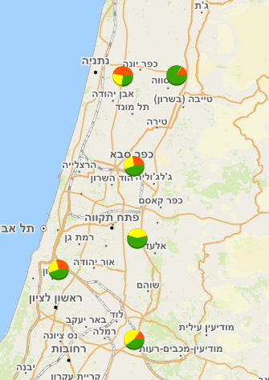

# ArcGIS CIMChartRenderer

**Added**: support for ArcGIS **CIMChartRenderer**  
(pie, bar, stacked-bar). The renderer is converted to a GeoStyler **Icon**  
symbolizer and exported back to SLD as an `<ExternalGraphic>` with  
`Format="application/chart"`.

*Note*: by default, sld doesn't support chart styling.
To support charts, GeoServer allows the installation of a chart extension.
Without the extension, the generated styles won't be displayed on the map.
For more information, please read the following documentation:
https://docs.geoserver.geo-solutions.it/edu/en/pretty_maps/charting.html

> Example result in GeoServer for a Pie Chart after conversion:
<?xml version="1.0" encoding="UTF-8" standalone="yes"?>
<StyledLayerDescriptor xmlns="http://www.opengis.net/sld" xmlns:ogc="http://www.opengis.net/ogc" xmlns:xlink="http://www.w3.org/1999/xlink" xmlns:xsi="http://www.w3.org/2001/XMLSchema-instance" version="1.0.0" xsi:schemaLocation="http://www.opengis.net/sld StyledLayerDescriptor.xsd">
  <NamedLayer>
    <Name>gidulim</Name>
    <UserStyle>
      <Title>gidulim</Title>
      <FeatureTypeStyle>
        <Rule>
          <Name>Chart</Name>
          <Title>Chart</Title>
          <PointSymbolizer>
            <Graphic>
              <ExternalGraphic>
                <OnlineResource xlink:type="simple" xlink:href="http://chart?cht=p3&amp;chd=t:${100 * plantations / (plantations + field_crops + citrus_1)},${100 * field_crops / (plantations + field_crops + citrus_1)},${100 * citrus_1 / (plantations + field_crops + citrus_1)}&amp;chco=38a800,ffff00,ff5500&amp;chf=bg,s,FFFFFF00"/>
                <Format>application/chart</Format>
              </ExternalGraphic>
              <Opacity>1.0</Opacity>
              <Size>32</Size>
              <Rotation>0</Rotation>
            </Graphic>
          </PointSymbolizer>
        </Rule>
      </FeatureTypeStyle>
    </UserStyle>
  </NamedLayer>
</StyledLayerDescriptor>

